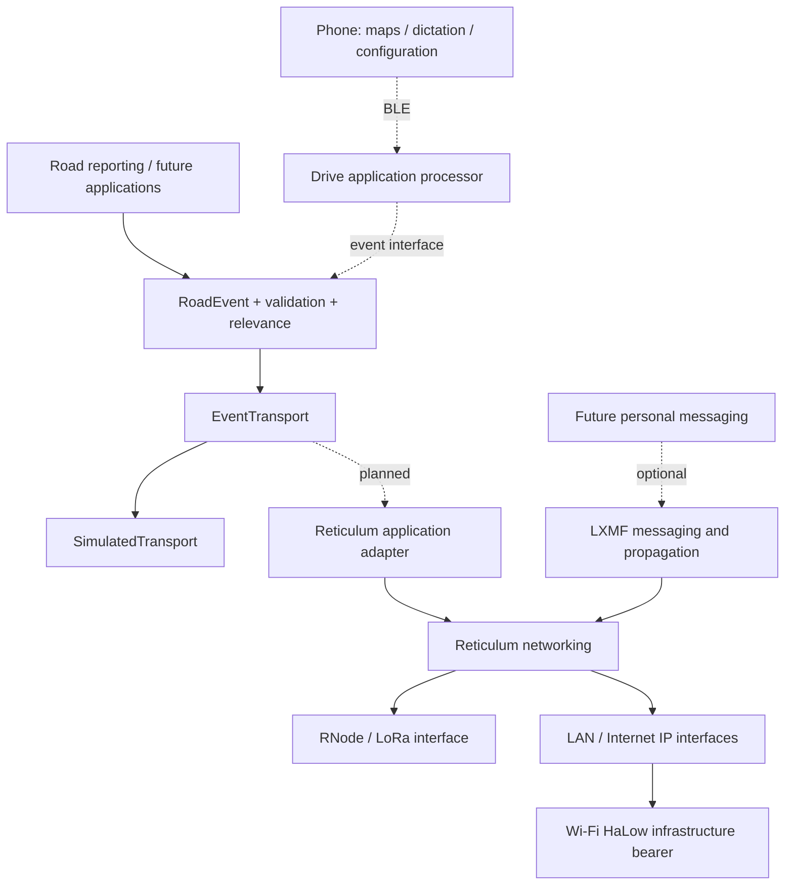

# System architecture

Status: foundation decisions accepted; radio/product architecture experimental.

## Responsibilities

| Layer | Owns | Does not own |
| --- | --- | --- |
| Wawet | Event semantics, expiry, relevance, application abuse policy, UX | Radio routing protocol |
| Reticulum | Destinations, identity-based networking and heterogeneous interface transport | Whether a road report is true or relevant |
| LXMF | Optional messaging and propagation service | Automatic geographic road-report dissemination |
| RNode | Radio modem/interface firmware | Automatically running the Wawet application or full Reticulum host |
| Bearer | Physical/link connectivity | Application event taxonomy |

The role separation above is a design decision grounded in the
[Reticulum manual](https://reticulum.network/manual/understanding.html),
[hardware documentation](https://reticulum.network/manual/hardware.html) and
[LXMF upstream](https://github.com/markqvist/LXMF).

## Current executable path

A `Vehicle` accepts an `EventTransport` and a clock callable. `report()` creates
an event at the current position and sends encoded bytes. A delivery callback
validates bytes, applies temporal checks, retains bounded events and rejects
duplicates. `alerts()` prunes expiry and recomputes relevance against current
position. Unknown categories remain decodable but never become named alerts.

`EventTransport.subscribe(receiver)`, `send(bytes)` and `close()` form the
boundary. `Delivery` supplies receive time, medium and a conservative
`authenticated=False` default. Authentication metadata never means report
truth. The vehicle clock is authoritative for expiry; delivery timestamps are
informational. Adapters must marshal callbacks onto one application thread.

The simulator schedules integer-second deliveries in deterministic order.
Named links model contact; a link must exist at send and delivery. It uses no
radio range model and no hidden retransmission, gossip or routing. Update a
vehicle's `Position` between clock advances to model motion. Applications can
be exercised through another transport without importing simulation code.

## Planned network path

Host a real RNS stack on a gateway first. Evaluate direct peer delivery and
identity-based routed delivery separately. Discovery overhead, peer contact
time and end-to-end frame size must be measured before choosing announcement
policy, geographic subscriptions or store-and-forward behaviour. Local
application dissemination must not become a second general routing protocol.
A re-send preserves original event creation time and expiry.

A tiny RNode-based edge is not yet an autonomous Wawet endpoint. Compare a
separate host processor, a constrained compatible implementation, and phone-
assisted operation. The recommended consumer concept needs useful standalone
operation; an always-present phone cannot silently become a requirement.

## Infrastructure and observability

Gateway hosts may expose logs and counters (valid, expired, duplicate, dropped,
rate-limited events), interface health and measured delivery latency. Later,
export low-cardinality metrics to Prometheus and provide opt-in MQTT/Home
Assistant bridges. Do not export raw locations or pseudonyms as metric labels.
Do not put Prometheus, map matching or speech recognition in tiny Drive firmware.
No executable Gateway service or firmware exists yet.
