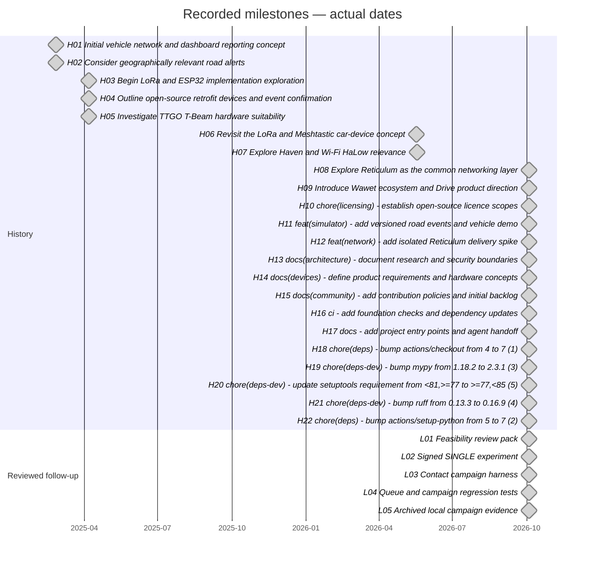
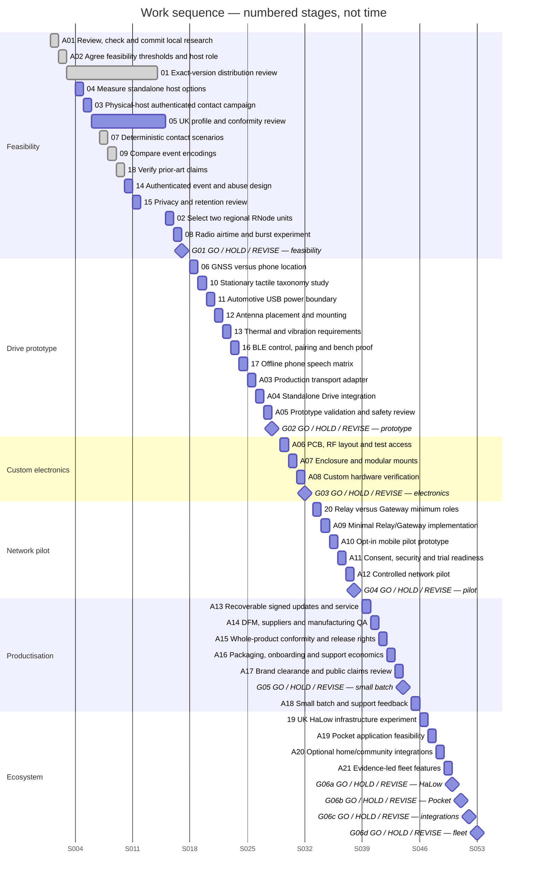

# Wawet project plan and Gantt chart

**Current status — 4 October 2026:** task 01 is complete for the bounded reviewed scope; see the [adopted maintainer decision](research/distribution-decision.md). Original Wawet work and optional user-installed RNS research continue with conditions; upstream redistribution and commercial bundles remain unapproved. G01 remains HOLD; tasks 02–05 remain open. Earlier pending-adoption, mandatory-review and uncommitted-status entries below are historical. The maintainer subsequently authorised committing and pushing this decision package.

Initial snapshot: **4 October 2026**, inspected at HEAD `29bccc6`. A01 review
completed on the same date; research is now committed at `ae4ba6e` and `e42ae0e`.
One maintainer, working in free time. This is a dependency-led sequence, **not a dated delivery
schedule or an effort estimate**. There are no deadlines or purchasing commitments.

The current prototype investment decision remains **HOLD**. Task 01 is complete for its bounded reviewed scope; gates 02–05 remain open.
Completed local experiments are preparation, not physical-host, radio or product
acceptance. Evidence below includes archived repository records and the A01 local
rechecks; no physical-host or radio measurements are implied. Original project
history is preserved.

## How to read and maintain this plan

- **Committed**: a recorded Git milestone, with its actual commit date/hash.
- **Local uncommitted**: completed local work present in modified or untracked files
  when recorded; review/check/commit is required before treating it as a baseline.
- **Open**: remaining work, including partially prepared backlog gates.
- **Gate**: a future explicit go/hold/revise decision; a chart diamond is not approval.
- **Conditional**: optional expansion after the core product; each track has its own gate.
- **Deferred**: unscheduled scope, shown in the register only.

Future axis labels **S001–S053 mean work stages**. Mermaid requires dates:
its future chart uses synthetic ordinal days from 1970-01-01 solely to render
stage numbers. These source dates and bar lengths have **no calendar, duration,
lead-time or effort meaning**. A gate may pause progression indefinitely.

For conditional expansion, only the chosen track and its own gate are required;
unselected expansion rows can be skipped and stages renumbered.

Read the future chart top to bottom. It proposes one maintainer's execution order;
prerequisites in the register govern eligibility, not merely the preceding row.
Historically, 01 and 05 spanned other stages to show external review waiting while eligible work
continues; that overlap is not extra maintainer capacity or an estimated wait.
Unused stages 12–14 reserve room for the review outcomes without introducing new
work. Reviews can finish earlier or later; renumber the sequence when evidence changes.

After A02, licensing review, candidate-host measurements, physical-host IP tests,
contact fixtures and encoding comparison are independently eligible. After G01,
location, stationary inputs, power, antenna, environmental and BLE studies are
eligible; perform them sequentially as capacity permits. Optional speech (17)
may move later and does not block standalone Drive. After G05, expansion tracks
are independently optional; G06a–G06d represent independent decisions, not one coupled
launch of all expansion products.

Keep IDs stable, update status/evidence and prerequisites together, and renumber
stages in both chart and register when order changes. Preserve historical dates.
On a failed gate, record HOLD or REVISE and update the relevant ADR/requirements
before replanning downstream investment. A01 means a local commit, not a push/PR.
External reviews, equipment procurement and physical test arrangements are
unassigned and must be arranged; this document does not authorise spending,
external outreach, RF transmission or public-road trials.

## Historical and reviewed follow-up milestones

Concept entries record exploration, not hardware completion. All foundation
commits on 4 October remain point milestones: no development duration is inferred.
Follow-up milestones retain their original evidence dates; their A01 commit hashes
are recorded in the register. Committing preparation does not close a product gate.

## Work sequence

## Task register

### History

| ID / task | Status / position | Prerequisites | Completion criterion | Evidence / remaining blockers |
| --- | --- | --- | --- | --- |
| **H01** Initial vehicle network and dashboard reporting concept | Committed; 2025-02-25 / `8d5c231` | None | Historical concept, implementation or maintenance milestone recorded in Git; not proof of product feasibility. | [Evidence / specification](../docs/concept.md). None for this recorded milestone. |
| **H02** Consider geographically relevant road alerts | Committed; 2025-02-25 / `5dd7728` | None | Historical concept, implementation or maintenance milestone recorded in Git; not proof of product feasibility. | [Evidence / specification](../docs/concept.md). None for this recorded milestone. |
| **H03** Begin LoRa and ESP32 implementation exploration | Committed; 2025-04-07 / `afed731` | None | Historical concept, implementation or maintenance milestone recorded in Git; not proof of product feasibility. | [Evidence / specification](../docs/concept.md). None for this recorded milestone. |
| **H04** Outline open-source retrofit devices and event confirmation | Committed; 2025-04-07 / `e570670` | None | Historical concept, implementation or maintenance milestone recorded in Git; not proof of product feasibility. | [Evidence / specification](../docs/concept.md). None for this recorded milestone. |
| **H05** Investigate TTGO T-Beam hardware suitability | Committed; 2025-04-07 / `51a993b` | None | Historical concept, implementation or maintenance milestone recorded in Git; not proof of product feasibility. | [Evidence / specification](../docs/concept.md). None for this recorded milestone. |
| **H06** Revisit the LoRa and Meshtastic car-device concept | Committed; 2026-05-17 / `06f4179` | None | Historical concept, implementation or maintenance milestone recorded in Git; not proof of product feasibility. | [Evidence / specification](../docs/concept.md). None for this recorded milestone. |
| **H07** Explore Haven and Wi-Fi HaLow relevance | Committed; 2026-05-18 / `6d3b8df` | None | Historical concept, implementation or maintenance milestone recorded in Git; not proof of product feasibility. | [Evidence / specification](../docs/concept.md). None for this recorded milestone. |
| **H08** Explore Reticulum as the common networking layer | Committed; 2026-10-04 / `cb3cc5c` | None | Historical concept, implementation or maintenance milestone recorded in Git; not proof of product feasibility. | [Evidence / specification](../docs/concept.md). None for this recorded milestone. |
| **H09** Introduce Wawet ecosystem and Drive product direction | Committed; 2026-10-04 / `1323fc6` | None | Historical concept, implementation or maintenance milestone recorded in Git; not proof of product feasibility. | [Evidence / specification](../docs/concept.md). None for this recorded milestone. |
| **H10** chore(licensing): establish open-source licence scopes | Committed; 2026-10-04 / `5190f6b` | None | Historical concept, implementation or maintenance milestone recorded in Git; not proof of product feasibility. | [Evidence / specification](../LICENSING.md). None for this recorded milestone. |
| **H11** feat(simulator): add versioned road events and vehicle demo | Committed; 2026-10-04 / `cd0eed4` | None | Historical concept, implementation or maintenance milestone recorded in Git; not proof of product feasibility. | [Evidence / specification](../protocol/road-event-v1.md). None for this recorded milestone. |
| **H12** feat(network): add isolated Reticulum delivery spike | Committed; 2026-10-04 / `0a940bb` | None | Historical concept, implementation or maintenance milestone recorded in Git; not proof of product feasibility. | [Evidence / specification](../docs/research/reticulum-spike.md). None for this recorded milestone. |
| **H13** docs(architecture): document research and security boundaries | Committed; 2026-10-04 / `b22f058` | None | Historical concept, implementation or maintenance milestone recorded in Git; not proof of product feasibility. | [Evidence / specification](../docs/architecture/system.md). None for this recorded milestone. |
| **H14** docs(devices): define product requirements and hardware concepts | Committed; 2026-10-04 / `84a1136` | None | Historical concept, implementation or maintenance milestone recorded in Git; not proof of product feasibility. | [Evidence / specification](../devices/drive/docs/product-requirements.md). None for this recorded milestone. |
| **H15** docs(community): add contribution policies and initial backlog | Committed; 2026-10-04 / `35b31b3` | None | Historical concept, implementation or maintenance milestone recorded in Git; not proof of product feasibility. | [Evidence / specification](../docs/community/backlog.md). None for this recorded milestone. |
| **H16** ci: add foundation checks and dependency updates | Committed; 2026-10-04 / `548d214` | None | Historical concept, implementation or maintenance milestone recorded in Git; not proof of product feasibility. | [Evidence / specification](../.github/workflows/checks.yml). None for this recorded milestone. |
| **H17** docs: add project entry points and agent handoff | Committed; 2026-10-04 / `6a500e5` | None | Historical concept, implementation or maintenance milestone recorded in Git; not proof of product feasibility. | [Evidence / specification](../docs/agent-handoff.md). None for this recorded milestone. |
| **H18** chore(deps): bump actions/checkout from 4 to 7 (#1) | Committed; 2026-10-04 / `cb4a894` | None | Historical concept, implementation or maintenance milestone recorded in Git; not proof of product feasibility. | [Evidence / specification](../.github/workflows/checks.yml). None for this recorded milestone. |
| **H19** chore(deps-dev): bump mypy from 1.18.2 to 2.3.1 (#3) | Committed; 2026-10-04 / `ae0535c` | None | Historical concept, implementation or maintenance milestone recorded in Git; not proof of product feasibility. | [Evidence / specification](../pyproject.toml). None for this recorded milestone. |
| **H20** chore(deps-dev): update setuptools requirement from <81,>=77 to >=77,<85 (#5) | Committed; 2026-10-04 / `b18926a` | None | Historical concept, implementation or maintenance milestone recorded in Git; not proof of product feasibility. | [Evidence / specification](../pyproject.toml). None for this recorded milestone. |
| **H21** chore(deps-dev): bump ruff from 0.13.3 to 0.16.9 (#4) | Committed; 2026-10-04 / `f19b6dd` | None | Historical concept, implementation or maintenance milestone recorded in Git; not proof of product feasibility. | [Evidence / specification](../pyproject.toml). None for this recorded milestone. |
| **H22** chore(deps): bump actions/setup-python from 5 to 7 (#2) | Committed; 2026-10-04 / `29bccc6` | None | Historical concept, implementation or maintenance milestone recorded in Git; not proof of product feasibility. | [Evidence / specification](../.github/workflows/checks.yml). None for this recorded milestone. |

### Reviewed follow-up

| ID / task | Status / position | Prerequisites | Completion criterion | Evidence / remaining blockers |
| --- | --- | --- | --- | --- |
| **L01** Feasibility review pack | Committed; 2026-10-04 / `e42ae0e` | None | Review briefs, dependency inventory and HOLD decision recorded. | [Evidence / specification](../docs/research/feasibility-gates.md). Qualified reviews, quotes and physical measurements remain pending. |
| **L02** Signed SINGLE experiment | Committed; 2026-10-04 / `ae4ba6e` | None | Local authenticated delivery, churn and bounded absent-discovery experiment recorded. | [Evidence / specification](../tools/rns_authenticated_spike.py). Two physical hosts and deployment key lifecycle remain unproven. |
| **L03** Contact campaign harness | Committed; 2026-10-04 / `e42ae0e` | None | Repeatable controlled contact windows, socket reconnect, bounded overload and offline analysis implemented. | [Evidence / specification](../tools/rns_contact_campaign.py). Physical-host execution remains pending; product thresholds agreed in A02. |
| **L04** Queue and campaign regression tests | Committed; 2026-10-04 / `ae4ba6e`, `e42ae0e` | None | Regression coverage and historical 45-test contributor check recorded; queue regression is in tests/test_spike_queue.py. | [Evidence / specification](../tests/test_contact_campaign.py). A01 review/check passed; hosted Python 3.12/3.13 results not established. |
| **L05** Archived local campaign evidence | Committed; 2026-10-04 / `e42ae0e` | None | 490 full trials and 26 final-source smoke trials recorded with exact-source/raw archives. | [Evidence / specification](../docs/research/contact-campaign-results.md). Single-host controlled IP observations; no radio or clock-certified cross-host latency. |

### Feasibility

| ID / task | Status / position | Prerequisites | Completion criterion | Evidence / remaining blockers |
| --- | --- | --- | --- | --- |
| **A01** Review, check and commit local research | Complete; S001 / this documentation commit | L01, L02, L03, L04, L05 | Review all modified/untracked research and source, rerun relevant checks, separate historical/new evidence and commit reviewed work; no push implied. | [Evidence / specification](../docs/validation.md). Reviewed source/evidence committed at `ae4ba6e` and `e42ae0e`; new validation is recorded separately. No push. |
| **A02** Agree feasibility thresholds and host role | Committed; 2026-10-04 / `b46261b`; S002 | A01 | Record numeric latency/loss, contact-window, startup, memory, power and delivered-cost limits; clarify application host versus modem and stop/revise criteria. | [Evidence / specification](../docs/research/feasibility-gates.md). [T01–T09 and host boundary agreed](research/feasibility-thresholds.md) on 4 October 2026. Physical-host access remains outstanding. |
| **01** Exact-version distribution review | Complete locally; 2026-10-04; S003–S013 | A02 | Document maintainer self-review of exact releases where selected, rights/restrictions/notices, unresolved risks and a dated form-specific release decision; no external legal review required for task 01. | [Evidence / specification](../LICENSING.md). [Adopted decision and residual risks](research/distribution-decision.md); bounded scope complete, upstream redistribution/bundles unapproved. External review optional. LXMF unselected. |
| **04** Measure standalone host options | Open; S004 | A02 | Run parser/queue and networking workload on actual candidate hosts; archive runtime, memory, measured current, startup/recovery and total quoted cost; retain standalone usefulness. | [Evidence / specification](../docs/research/feasibility-gates.md). Candidate hardware and calibrated instruments absent. |
| **03** Physical-host authenticated contact campaign | Open; S005 | A02, L02, L03, L04, L05 | Two isolated physical hosts with SINGLE destinations; raw discovery/latency/loss/overhead, clock uncertainty, contact windows, timeout and stale-queue/recovery evidence against thresholds. | [Evidence / specification](../docs/research/contact-campaign.md). Only local controlled IP evidence exists; physical hosts and clock evidence pending. |
| **05** UK profile and conformity review | Open; S006–S014 | A02, 04 | Complete exact applicable IR2030 rows, access/power/antenna limits, standard editions, classification and written qualified lab assessment of proposed test setup. | [Evidence / specification](../docs/research/uk-regulatory.md). No approved radio profile or RF test setup. External review may run while stages 7–14 proceed. |
| **07** Deterministic contact scenarios | Committed; 2026-10-04 / `c0dd25b`; S007 | A02 | Passing, convoy, rural and dense fixtures with delivery/expiry metrics and no claims of field performance. | [Runbook and results](research/contact-scenarios.md). Four fixtures, 53-test contributor check and repeatable JSON; simulation only. |
| **09** Compare event encodings | Committed; 2026-10-04 / `3e247c8`; S008 | A02 | Measure bytes and parser footprint with bounded optional fields/signatures; preserve frozen v1 vectors and document comparisons. | [Comparison and results](research/encoding-comparison.md). Bounded desktop comparison complete; MCU/whole-host memory acceptance remains task 04; v1 unchanged. |
| **18** Verify prior-art claims | Committed; 2026-10-04 / `2f21ac5`; S009 | A01 | Locate repositories/licences and independent reproducible evidence; label unverified claims; import no unreviewed code. | [Review and evidence](research/prior-art.md). Eight-system desk review and pinned Waycast unit tests complete; GUI/physical/independent chronology remain unverified; no code imported. |
| **14** Authenticated event and abuse design | Open; S010 | 03, 09 | Specify signature/domain separation, key lifecycle and payload budget; test replay/flood/Sybil/corroboration limits; update protocol/ADR if behaviour changes. | [Evidence / specification](../docs/security/threat-model.md). Pinned local signatures are not a public trust system. |
| **15** Privacy and retention review | Open; S011 | 14 | Review wire/link correlation, define actual erasure schedule, consent and participant-data handling; record threat-review findings. | [Evidence / specification](../docs/security/privacy.md). Not started; requires listed predecessors. |
| **02** Select two regional RNode units | Open; S015 | 04, 05 | Confirm exact board/firmware targets, regional RF variant, antenna/profile and current delivered two-unit quotations; selection after host role is understood. | [Evidence / specification](../docs/research/feasibility-gates.md). Supported families are screened; exact revisions, antennas and delivered quotes remain unresolved. |
| **08** Radio airtime and burst experiment | Open; S016 | 02, 03, 05, 07, 14 | On approved setup, measure complete frames/control/retry traffic, legal airtime budget, simultaneous senders and freshness within contact deadlines. | [Evidence / specification](../docs/community/backlog.md). Requires physical radios and reviewed RF setup; no transmission authorised by this chart. |
| **G01** GO / HOLD / REVISE — feasibility | Gate; S017 | 01, 02, 03, 04, 05, 08 | Record evidence-backed closure of gates 01–05 and acceptable host/contact/airtime/cost results; otherwise hold or revise architecture/product and replan. | [Evidence / specification](../docs/research/feasibility-gates.md). Current decision is HOLD; task 01 complete for bounded scope, gates 02–05 open; bundled-image approval withheld. |

### Drive prototype

| ID / task | Status / position | Prerequisites | Completion criterion | Evidence / remaining blockers |
| --- | --- | --- | --- | --- |
| **06** GNSS versus phone location | Open; S018 | G01 | Measure cold/warm starts, no-phone operation, bad-sky/stale fixes, locked-phone permissions/BLE and cost; select valid location/time policy. | [Evidence / specification](../devices/drive/docs/product-requirements.md). Not started; requires listed predecessors. |
| **10** Stationary tactile taxonomy study | Open; S019 | G01 | Compare three/four-input stationary mockups; measure touch differentiation, mistakes, feedback, accidental activation and undo. | [Evidence / specification](../devices/drive/docs/human-factors.md). Not started; requires listed predecessors. |
| **11** Automotive USB power boundary | Open; S020 | G01, 04 | Compare adapters/cables; measure ignition/brownout, abrupt loss/restart and parked standby; choose protected power boundary. | [Evidence / specification](../devices/drive/docs/product-requirements.md). Not started; requires listed predecessors. |
| **12** Antenna placement and mounting | Open; S021 | G01, 02, 05 | Measure supplied-antenna RF in representative vehicles and assess safe placement, strain relief and removal on approved setup. | [Evidence / specification](../devices/drive/docs/hardware-concepts.md). Not started; requires listed predecessors. |
| **13** Thermal and vibration requirements | Open; S022 | G01 | Measure environments, choose component/enclosure limits, UV/adhesive requirements and qualified lab plan; avoid invented ratings. | [Evidence / specification](../devices/drive/docs/product-requirements.md). Not started; requires listed predecessors. |
| **16** BLE control, pairing and bench proof | Open; S023 | G01, 14, 15 | Define command/result bodies and authenticated no-display ownership flow; test bounded MTU/replay, denial/disconnect and no-phone independence on bench. | [Evidence / specification](../devices/drive/docs/ble-gatt.md). Not started; requires listed predecessors. |
| **17** Offline phone speech matrix | Open; S024 | 16, 15 | Measure Android/iOS device/language offline support, permission handling, latency and failure without upload. | [Evidence / specification](../docs/research/phone-speech.md). Optional phone feature; may be deferred without blocking standalone Drive. |
| **A03** Production transport adapter | Open; S025 | G01, 14, 15 | Implement only justified RNS integration; serialise callbacks to application thread, bound queues, preserve expiry on retries, test key/lifecycle/shutdown/recovery. | [Evidence / specification](../docs/architecture/system.md). Not started; requires listed predecessors. |
| **A04** Standalone Drive integration | Open; S026 | A03, 06, 10, 11, 12, 13, 16 | Integrate selected host/radio, valid GNSS/time, tactile inputs, power, supplied antenna and BLE; demonstrate useful phone/cloud-free operation and stale-fix withholding. | [Evidence / specification](../devices/drive/docs/product-requirements.md). Not started; requires listed predecessors. |
| **A05** Prototype validation and safety review | Open; S027 | A04, 14, 15 | Pass stationary UX, vectors/flood/expiry, location/time fault, power recovery, mounting and diagnostic privacy tests; approve controlled vehicle plan before moving tests. | [Evidence / specification](../devices/drive/docs/human-factors.md). Not started; requires listed predecessors. |
| **G02** GO / HOLD / REVISE — prototype | Gate; S028 | A05 | Record standalone operation and safe stationary UX evidence, cost and controlled-test readiness; resolve critical findings before custom electronics. | [Evidence / specification](../docs/roadmap.md). Not started; requires listed predecessors. |

### Custom electronics

| ID / task | Status / position | Prerequisites | Completion criterion | Evidence / remaining blockers |
| --- | --- | --- | --- | --- |
| **A06** PCB, RF layout and test access | Open; S029 | G02 | Create original schematics/PCB, RF layout, protected power, debug/recovery and manufacturing pads; review licence/source scope and costed BOM. | [Evidence / specification](../devices/drive/docs/product-requirements.md). Not started; requires listed predecessors. |
| **A07** Enclosure and modular mounts | Open; S030 | A06, 12, 13 | Design enclosure/mount/cable system with serviceability, measured thermal/UV/vibration and safe vehicle placement requirements. | [Evidence / specification](../devices/drive/docs/hardware-concepts.md). Not started; requires listed predecessors. |
| **A08** Custom hardware verification | Open; S031 | A06, A07, 05 | Run electrical, RF, environmental and recovery tests; capture failures/revisions and current BOM/assembly/yield estimates. | [Evidence / specification](../docs/roadmap.md). Not started; requires listed predecessors. |
| **G03** GO / HOLD / REVISE — electronics | Gate; S032 | A08 | Prototype passes agreed electrical/RF/environmental limits with viable costed BOM; approve pilot investment or revise. | [Evidence / specification](../docs/roadmap.md). Not started; requires listed predecessors. |

### Network pilot

| ID / task | Status / position | Prerequisites | Completion criterion | Evidence / remaining blockers |
| --- | --- | --- | --- | --- |
| **20** Relay versus Gateway minimum roles | Open; S033 | G03, A03, 08 | Prove forwarding responsibilities and propagation separately from modem; measure power, airtime and total cost. | [Evidence / specification](../devices/gateway/README.md). Not started; requires listed predecessors. |
| **A09** Minimal Relay/Gateway implementation | Open; S034 | 20 | Implement justified forwarding/service roles using RNS; bounded freshness, opt-in diagnostics and low-cardinality metrics without raw locations. | [Evidence / specification](../docs/architecture/system.md). Not started; requires listed predecessors. |
| **A10** Opt-in mobile pilot prototype | Open; S035 | G03, 16, 15 | Provide minimal pairing/maps/report interface for pilot, with explicit permissions and phone-absent baseline; speech included only if task 17 passes. | [Evidence / specification](../devices/drive/docs/feature-matrix.md). Not started; requires listed predecessors. |
| **A11** Consent, security and trial readiness | Open; S036 | A09, A10, A05, 14, 15 | Revalidate authenticated reports, abuse/privacy and erasure; define participants, safe sites, consent, approved radio/driver plan and stop criteria. | [Evidence / specification](../docs/security/privacy.md). Not started; requires listed predecessors. |
| **A12** Controlled network pilot | Open; S037 | A11 | Collect consented multi-device/vehicle coverage, freshness, density/usefulness, failure and support evidence under reviewed controlled-test plan. | [Evidence / specification](../docs/roadmap.md). No public road trial before radio and driver safety review; no real participant locations committed. |
| **G04** GO / HOLD / REVISE — pilot | Gate; S038 | A12 | Demonstrate useful authenticated coverage/freshness, manageable privacy/abuse/support burden and willingness to pay; revise if participation economics fail. | [Evidence / specification](../docs/business/open-source-commercial-model.md). Not started; requires listed predecessors. |

### Productisation

| ID / task | Status / position | Prerequisites | Completion criterion | Evidence / remaining blockers |
| --- | --- | --- | --- | --- |
| **A13** Recoverable signed updates and service | Open; S039 | G04, 14 | Implement signed update, interrupted-update recovery/rollback, ownership transfer, debug/service access and documented support lifetime. | [Evidence / specification](../devices/drive/docs/product-requirements.md). Not started; requires listed predecessors. |
| **A14** DFM, suppliers and manufacturing QA | Open; S040 | G04, A08 | Freeze costed BOM/alternatives, supplier quotes, DFM, functional/RF fixtures, serial/revision traceability, yield and supply continuity. | [Evidence / specification](../devices/drive/docs/product-requirements.md). Not started; requires listed predecessors. |
| **A15** Whole-product conformity and release rights | Open; S041 | A13, A14, 01, 05 | Obtain applicable final-product radio/EMC/safety/environmental conformity evidence, technical file/declarations/markings and exact release dependency/source obligations. | [Evidence / specification](../LICENSING.md). Qualified conformity and distribution review required; module listing is insufficient. |
| **A16** Packaging, onboarding and support economics | Open; S042 | A14 | Validate supplied accessories, accessible instructions/onboarding, teardown/service, warranty/returns, delivered/channel costs and support burden. | [Evidence / specification](../docs/business/open-source-commercial-model.md). Not started; requires listed predecessors. |
| **A17** Brand clearance and public claims review | Open; S043 | G04 | Resolve working-name/trademark clearance and verify price, range, privacy/safety and availability claims against evidence. | [Evidence / specification](../docs/business/trademark-policy.md). Not started; requires listed predecessors. |
| **G05** GO / HOLD / REVISE — small batch | Gate; S044 | A13, A14, A15, A16, A17 | Approve compliant manufacturable release, viable unit economics, recovery/support/warranty and traceability; then authorise a limited batch separately. | [Evidence / specification](../docs/roadmap.md). Not started; requires listed predecessors. |
| **A18** Small batch and support feedback | Open; S045 | G05 | Produce authorised limited batch, record QA/yield/returns/support and correct defects before wider scale. | [Evidence / specification](../docs/roadmap.md). Not started; requires listed predecessors. |

### Ecosystem

| ID / task | Status / position | Prerequisites | Completion criterion | Evidence / remaining blockers |
| --- | --- | --- | --- | --- |
| **19** UK HaLow infrastructure experiment | Conditional; S046 | A18, 20 | Obtain regional module quotes, review driver/firmware rights and approved legal profile; measure IP goodput/current. | [Evidence / specification](../docs/research/halow.md). Not started; requires listed predecessors. |
| **A19** Pocket application feasibility | Conditional; S047 | A18 | Define standalone Pocket use cases; measure battery/power, privacy, usefulness and applicable radio feasibility before product commitment. | [Evidence / specification](../devices/pocket/README.md). Not started; requires listed predecessors. |
| **A20** Optional home/community integrations | Conditional; S048 | A18, A09 | Validate opt-in MQTT/Home Assistant/community uses with clear gateway roles, privacy, power and usefulness gates. | [Evidence / specification](../docs/architecture/system.md). Not started; requires listed predecessors. |
| **A21** Evidence-led fleet features | Conditional; S049 | A18 | Validate fleet demand, install/support economics and privacy without mandatory basic-use subscription or accounts. | [Evidence / specification](../docs/business/open-source-commercial-model.md). Not started; requires listed predecessors. |
| **G06a** GO / HOLD / REVISE — HaLow | Gate; S050 | 19 | Review this track against measured goodput/current, UK profile, dependency rights and infrastructure usefulness; proceed independently or defer. | [Evidence / specification](../docs/research/halow.md). Not started; requires listed predecessors. |
| **G06b** GO / HOLD / REVISE — Pocket | Gate; S051 | A19 | Review Pocket use cases, battery/power, privacy, radio feasibility and usefulness; proceed independently or defer. | [Evidence / specification](../devices/pocket/README.md). Not started; requires listed predecessors. |
| **G06c** GO / HOLD / REVISE — integrations | Gate; S052 | A20 | Review each integration for opt-in privacy, gateway power, regulatory scope and demonstrated usefulness; proceed independently or defer. | [Evidence / specification](../docs/architecture/system.md). Not started; requires listed predecessors. |
| **G06d** GO / HOLD / REVISE — fleet | Gate; S053 | A21 | Review fleet demand, privacy and measured installation/support economics; preserve standalone basic use and proceed independently or defer. | [Evidence / specification](../docs/business/open-source-commercial-model.md). Not started; requires listed predecessors. |

### Deferred

| ID / task | Status / position | Prerequisites | Completion criterion | Evidence / remaining blockers |
| --- | --- | --- | --- | --- |
| **D01** Sensor applications | Deferred; Unscheduled | None | Define separate use case and its own power/privacy/regulatory/usefulness gates before scheduling. | [Evidence / specification](../docs/vision.md). Future scope; no promised prototype. |
| **D02** Optional long-distance research | Deferred; Unscheduled | None | Justify a separate research objective and regional legal/licensing constraints before scheduling. | [Evidence / specification](../docs/research/amateur-radio.md). Optional future research; no approved consumer carriage. |

## Reconciliation and validation

All [20 backlog IDs](community/backlog.md) are retained. [Roadmap](roadmap.md)
phase 0 is the committed history/local follow-up; phase 1 is the feasibility
sequence plus production transport and BLE bench proof; phase 2 is standalone
Drive integration and prototype validation; phases 3–6 are custom electronics,
pilot, productisation and conditional expansion respectively. Task scheduling
crosses the broad roadmap labels where integration needs it; no phase gate is
bypassed. G01 is the added explicit investment decision for gates 01–05.

A01 reviewed all originally modified/untracked research and source. `ae4ba6e`
commits the signed spike, queue test and initial raw/inventory records; `e42ae0e`
commits campaign tooling/tests, feasibility briefs, historical archives and new
A01 revalidation. This documentation commit adds the plan and README/roadmap links,
records completion and updates the handoff. All commits are local; nothing was pushed.

**Historical position after A02 agreement:** tasks 01, 04, 03, 07 and 09 are
eligible. Task 01 is next in the registered sequence but requires qualified review;
04 needs candidate hardware/instruments and 03 needs two physical hosts. Task 07
is the first eligible software-only package in that sequence when those resources
are unavailable. Task 18 remains independently eligible after A01. Gates 01–05 and G01 HOLD remain unchanged; preparation is not acceptance.

Historical checks and counts remain in [validation](validation.md): the recorded
31-test foundation and 45-test follow-up must not be read as new runs here.

Initial plan verification on 4 October 2026 (historical): all task IDs unique; backlog 01–20 fully
covered; evidence files exist; dependency graph acyclic and every scheduled
predecessor ends before its dependent stage. Repository Markdown file-link checks
passed. Both Mermaid diagrams rendered successfully in a temporary browser preview
using Mermaid 10.9.1 (no project dependency added). Interactive selection passed
for all 79 entries; keyboard selection and history/future views passed. At content
widths 320px and 736px, measured scroll width equalled content width. Desktop
rendering was visually inspected. `python3 tools/check_links.py` and
`git diff --check` passed. External links/anchors, new experiment runs and hosted
CI are outside this planning verification. No executable behaviour changed, so
unit/RNS campaigns were not rerun for this documentation-only change.

A01 plan reconciliation on 4 October 2026: L01–L05 now record actual local commit
hashes, A01 is complete and A02 is next. All 79 task IDs are unique, backlog
01–20 is covered and the dependency graph remains acyclic with valid references.
Task IDs, dependencies, stage numbering and historical dates are preserved.
Markdown file links and `git diff --check` passed. New checks and loopback results are recorded
in [validation](validation.md); historical rendering results above were not rerun.

A02 agreement on 4 October 2026: maintainer accepted T01–T09 and the host boundary
without changes. A02 is complete locally; criteria are not physical acceptance.
Dependencies, stages and historical validation records remain unchanged.

## Task 07 completed — 4 October 2026

A02 documentation was reviewed, checked and committed separately at `b46261b`.
Task 07 adds four deterministic contact fixtures, acceptance/expiry/drop results
and eight regression tests; [runbook/evidence](research/contact-scenarios.md)
records the new validation. The earlier next-package statements are historical.
Task 09 is now next in the software sequence; 01/04/03 still need qualified
review, hardware/instruments or physical-host evidence. Task 18 remains eligible.
Task 08 has its 07 prerequisite satisfied but still requires 02/03/05/14.
Gates 01–05 and G01 HOLD remain unchanged. No push or publication occurred.

## Task 09 completed locally — 4 October 2026

The [bounded encoding comparison](research/encoding-comparison.md) provides exact
size tables and isolated desktop parser evidence for binary extensions and a
restricted CBOR profile, with bounded optional fields and key/signature placeholders.
Task 09 is complete for this desktop scope; task 04 still owns actual MCU/whole-host
memory acceptance. Task 18 is next eligible in the software sequence. Task 14's
09 prerequisite is satisfied, but physical-host task 03 remains open. Gates 01–05,
G01 HOLD and registered dependencies remain unchanged. Work is local/uncommitted;
no push or publication occurred. Earlier next-package entries remain historical.

## Task 18 completed locally — 4 October 2026

Git inspection at clean HEAD `3e247c8` confirms task 09 was committed; its earlier
uncommitted notes describe the capture state and are preserved as history. Task 07
is committed at `c0dd25b`, and A02 at `b46261b`.

[Task 18](research/prior-art.md) now provides an eight-system evidence register,
exact searches/access limits and independent reproduction of three isolated
Waycast unit-test executables at a pinned upstream revision. Source/licence/history
are established within that scope; independent physical claims and GUI reproduction
remain unverified. No upstream code was imported into Wawet. Task 18 is complete
for the agreed desk investigation; no dependency or stage numbering changed.

There is no next unblocked software package in the registered feasibility sequence.
Task 14 still requires physical-host task 03; 15 requires 14. Arrange task 01's
qualified review, task 04's hardware/instruments or task 03's two physical hosts
and clock evidence before their acceptance work. Preparation remains distinct from
acceptance; gates 01–05 and G01 HOLD persist. This follow-up is local/uncommitted;
no outreach, purchase, RF transmission, push or publication occurred.

## Task 01 dossier prepared — 4 October 2026

Task 01 now has an [exact-version review dossier](research/distribution-review.md):
dossier prepared; qualified review pending. It remains open with its existing
prerequisites. Task 18 is committed at `2f21ac5`; preceding local/uncommitted notes
are historical. No task dependencies or stages change. Gates 01–05 and G01 HOLD
persist; there is still no unblocked software implementation package.

Documentation/evidence only; no runtime changes, outreach, purchasing, RF tests,
commit, push or publication occurred in this follow-up.

## Task 01 reviewer arrangement prepared — 4 October 2026

The [reviewer arrangement package](research/distribution-review-arrangement.md) adds two UK legal-review
candidates, a community referral route, an unsent enquiry and an engagement
checklist. Starting tree was clean at `ff3df9f`, which commits the dossier;
earlier uncommitted entries remain historical. This package is local/uncommitted.
Reviewer selection, authorised contact, engagement terms and qualified written
review remain pending. Task 01 is open; gates 01–05 and G01 HOLD persist.
No stages or dependencies change: 14 still requires physical-host 03 and 09;
15 requires 14. No outreach, commissioning, spending, runtime changes, commit,
push or publication occurred. Validation is recorded in the validation document.

## Task 01 self-review direction — 4 October 2026

The maintainer declined hiring a reviewer: this is a solo free-time project.
The next package is [bounded maintainer self-review](research/distribution-review-arrangement.md) of Q01–Q07,
vendor notices and form-specific distribution decisions. Reviewer routes and the
unsent enquiry remain historical preparation; external engagement is deferred.
Self-review can advance evidence and decisions but does not satisfy the existing
qualified-review acceptance criterion. No task dependency or gate criterion is
silently relaxed; task 01 remains open and G01 HOLD persists. No outreach or
spending is needed for the bounded self-review. That review is not yet completed.

## Task 01 bounded self-review completed — 4 October 2026

The [agent-assisted self-review](research/distribution-self-review.md) assesses Q01–Q07, recovers
complete attributable ConfigObj/i2plib notices and records exact vendored
comparisons plus static macOS research-wheel observations. Notice retrieval gaps
are narrowed; modification authorship, native shipped notices/build provenance,
AI service data use and future-image scope remain unresolved. Its conservative
form-specific approach is proposed for maintainer adoption, not a recorded release
approval. Paid review is deferred; the existing qualified-review criterion remains
unsatisfied. Task 01 stays open, gates 01–05 and G01 HOLD persist. No prerequisites
or stages change. Prior local changes were preserved; this follow-up is uncommitted.
No packages installed/executed, outreach, spending, RF/road test or publication.

## Task 01 assurance decision — 4 October 2026

**DESIGN DECISION:** the maintainer explicitly chose to perform task 01 ourselves
and instructed updating the task accordingly. A documented maintainer self-review
and dated form-specific release/risk decision replace the previous mandatory
qualified external review for task 01. External advice is optional, not a required
paid prerequisite. Earlier qualified-review entries are historical and superseded
by this decision; no professional legal approval is asserted.

The [self-review](research/distribution-self-review.md) supplies the evidence assessment. Task 01 remains
open until the maintainer records adopted distribution decisions, conditions and
residual risks, including unresolved AI data-use and provenance questions. This
instruction changes the assurance method; it does not itself approve a bundle or
adopt every recommendation. G01 stays HOLD and other task prerequisites and
technical/regulatory gates remain unchanged. Restricted upstream terms and notice
obligations are not waived. Re-review changed uses, releases and shipped builds.
